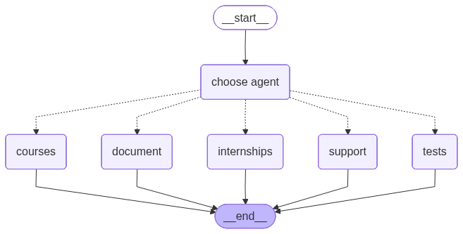
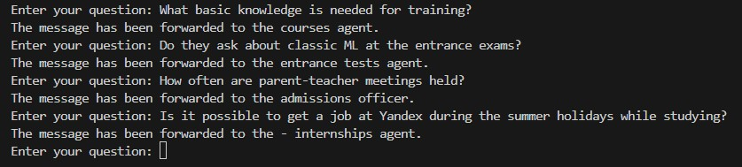

# LLM Router

The Admissions Committee for the Master's Program in Artificial Intelligence receives numerous students with similar questions every day.

The questions are divided into four groups (topics):
- document submission (подача документов)
- entrance tests (входные испытания)
- curriculum and courses (учебный план и дисциплины)
- internships (стажировки)
- other (другое)

Each question group can have its own AI agent implemented.

This project is responsible for routing requests to the appropriate parts of the system.

## Project struct
- `main.py` : main loop
- `router.py` : LLM router implementation with LangChain 
- `graph.py` :  application graph
- `.env` : enviroment varibales
- `Dockerfile` : to build docker image
- `requirements.txt` : requirements for project launch
- **`img`** : pictures for presentation

## Implemented functionality
- Question Classification
- Question Forwarding to Agents (template)
- Graph Visualization

## Graph
After receiving a question from a user, the request is sent to the router, then, depending on the category of the question, it is transferred to one of the AI ​​agents (documents, courses, tests, inernships) or to an admissions officer (human support).



## Launhing
### Docker
```
docker build -t llm-router .
docker run -it -e MISTRAL_KEY=<your mistral api key> llm-router
```

### Local
1. create venv
```cmd
python -m venv venv
.\venv\Scripts\activate
pip install -r requirements.txt
```

2. Insert your mistral api key into .env

3. run router
```cmd
python main.py
```

-----------
! To exit press **`Ctrl + C`**

-----------

## Example of work
The screenshot shows how the router categorizes questions and forwards them to the AI agents.

